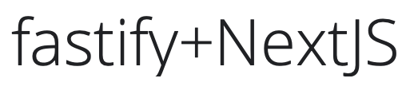

<div align="center">
  
  <h1>fastify-nextjs-project</h1>
  <h4 align="center">🐅 Project template to build a Fastify + NextJS application</h4>
</div>

## Install dependencies

```sh
yarn install
```

### Run development server

```sh
yarn dev
```

### Create bundle for production

```sh
yarn build
```

### Serve production bundle

```sh
# This command requires `yarn build`
yarn start
```

### Lint project files

```sh
yarn fmt
```
